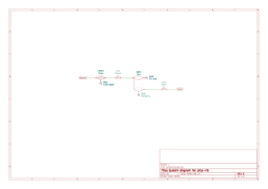
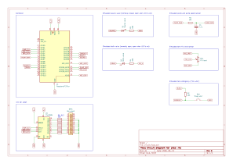

# pico-rio

Measurement and control with the Raspberry Pi Pico RP 2040.

## Overview

The goal of this project is to learn embedded development with Rust and its Embassy framework on the Raspberry Pi Pico.

I took inspiration for the application and the architecture of the system from the industrial systems I encountered at work. The [application](#application) is a simple fill controller for a water tank.

## Credits

This project is based on the excellent [examples](https://github.com/embassy-rs/embassy/blob/main/examples/rp/) for the Raspberry Pi Pico in the Embassy project. In particular, the networking code is heavily based on [usb_ethernet.rs](https://github.com/embassy-rs/embassy/blob/main/examples/rp/src/bin/usb_ethernet.rs).

Messages and commands are encoded and decoded with the `postcard` crate. The DHCP server is provided by the `leasehound` crate.

## Building

1. Clone the repository.
2. Cargo currently does not support packages with different target architectures in the same workspace. You have to build the packages manually.
   a. Build the shared `messages` library:

        pushd messages
        cargo build
        popd

   b. Build the `tools`:

        pushd tools
        cargo build
        popd

   c. Build `pico-rio.uf2`:

        pushd pico
        cargo run --release
        popd

   d. Alternatively, run the build script from the project root folder to build all projects:

        ./build.sh

   *Note*: We build `pico-rio.uf2`, we don't install it. Edit `.cargo/config.toml` if you want to build and install it on your Pico with `probe-rs`.

3. Install `build/pico-usb-ethernet.uf2` on your Pico by copying it to the Pico when the Pico is in boot mode. For example, on macOS:

        cp build/pico-usb-ethernet.uf2 /Volumes/RPI-RP2

4. Use the tools in the [./tools/](./tools/) folder to talk to the Pico.

   Adjust the hardcoded addresses and ports in `NetworkSettings` at the bottom of [./pico/src/main.rs](./pico/src/main.rs) to match your configuration. By default, the Pico

   - listens on 192.168.7.1 and port 1234
   - sends to 192.168.64.47 and port 12345

## Tools

### Observe

    cargo run --bin observe PORT

The `observe` tool listens for messages from the Pico on the specified `PORT`. The tool prints status information for the running tasks and measurements. For example:

```
192.168.7.1: digital in at 6.005357s (+ 0ns) with period 1s took 64µs
192.168.7.1: digital in pin 18: off
192.168.7.1: digital in pin 19: on
192.168.7.1: digital in pin 20: off
192.168.7.1: digital in pin 21: off
```

Pipe the output through grep if you want to focus on specific items.

### Instruct

    cargo run --bin instruct ADDRESS:PORT COMMAND

The `instruct` tool sends `COMMAND` to the Pico at the specified `ADDRESS` and `PORT`. Refer to the [Application](#application) section and the default [pin assignments](#core-1) for more information on how to use these commands and where to find `PIN` numbers.

Available commands are:

```
ping
```

Test the connection to the Pico.

```
digital PIN on|off
```

Turn a digital `PIN` `on` or `off`.

```
analog PIN 0-100
```

Set the duty cycle of the PWM on `PIN` to a value in the range 0 to 100.

```
bar_graph PIN
```

Show the value of `PIN` on the LED bar. Analog values from 0 to 100 are scaled to 0 to 8 LEDs. Digital values light up either no LEDs (`off`) or all LEDs (`on`).

```
bang_bang start
```

Start the bang-bang controller.

```
bang_bang stop
```

Stop the bang-bang controller.

```
bang_bang input PIN
```

Set the input `PIN` of the bang-bang controller.

```
bang_bang output PIN
```

Set the output `PIN` of the bang-bang controller.

```
bang_bang lower 0-100
```

Set the lower bound of the bang-bang controller to a value in the range 0 to 100.

```
bang_bang upper 0-100
```

Set the upper bound of the bang-bang controller to a value in the range 0 to 100.

## System architecture

The system is split up into tasks that communicate with each other. Core 0 of the Pico handles network communication with the host computer. Core 1 runs the application tasks that take measurements and control outputs.


### Core 0

| Function | Task | Description |
|-|-|-|
| USB | `usb_task` | Controls the USB connection. |
| USB | `logging_task` | Provides a serial port interface for logging. |
| Network | `ethernet_task` | Implements the ethernet protocol on top of the USB connection. |
| Network | `network_task` | Provides the UDP/IP network stack. |
| Network | `notify_when_available` | Signals to the other tasks when the network stack is ready to use. |
| Network | `dhcp_server` | Provides a DHCP server from the `leasehound` crate. It assigns a local address to the Pico. And importantly, it assigns a local address to the host computer so that it can act as a gateway to the outside world. |
| Network | `inbound` | Waits for commands to the Pico. |
| Network | `outbound` | Sends messages from the Pico. |
| Watchdog| `watchdog` | Restarts the system if the system becomes unresponsive. Application tasks have to notify the watchdog at least once every three seconds that they are running normally. |

All network communication for the application, commands and messages, goes through the `inbound` and `outbound` tasks. Commands and messages are encoded in the `postcard` format from the `postcard` crate.

### Core 1

| Function | Task | Pins | Description |
|-|-|-|-|
| Measurements | `digital_in` | 18, 19, 20, 21 | Samples digital input pins and reports their levels. |
| Measurements | `digital_out` | 10, 11, 12, 13, 25 (built-in LED) | Sets digital output pins and reports their levels. |
| Measurements | `analog_in` | 26, 27, 28 | Samples analog input pins with the built-in ADC and reports their levels. |
| Measurements | `analog_out` | 6, 8 | Sets analog output pins with the built-in PWM and reports their levels. |
| Measurements | `measurements` | | Collects the current values of all input and output pins. |
| Control | `bang_bang` | | Implements a simple bang-bang controller. When input is<br/>- below the upper limit, turn on the output.<br/>- above the upper limit, turn off the output.<br/>- falls below the upper limit, wait until it hits the lower limit.<br/>- falls below the lower limit, turn on the output again.<br/>The output is proportional to the different between the input and the upper limit. |
| Debugging | `bar_graph` | 2 (clock), 3 (latch), 4 (data) | Shows one of the current `measurements` in an LED bar with eight LEDs. The LED bar is driven by a 74HC595 shift register with control pins `clock`, `latch`, and `data`. |

## Application

The application is a simple fill controller for a water tank.

### System diagram



Water enters the system from the `source`. The `pump` pumps the waters into the `tank` when the `source` valve is open. When the `drain` valve is open, water leaves the tank and flows into the `drain`.

### Prototype circuit

The prototyping circuit simulates actuators and sensors with LEDs, buttons, and variable resistors.

| Item | Kind | Function | Circuit | Pin |
|-|-|-|-|-|
| Tank | Tank | The water tank. | - | - |
| Source | Source | The water source. | - | - |
| Drain | Drain | The water drain. | - | - |
| Pump | Actuator | Pumps water from source to tank. | PWM signal with duty-cycle 0 to 100. | 6 |
| Source valve | Actuator | Normally closed valve controls flow from source to tank. | Red LED. On when valve is open. | Set 10, Feedback 20 |
| Drain valve | Actuator | Normally open valve controls flow from tank to drain. | Yellow LED. On when valve is open. | Set 11, Feedback 21 |
| Pump speed | Sensor | Measures speed of pump. | Low-pass filter from PWM to voltage. Range 0 to 100. | 26 (ADC_0) |
| Fill level | Sensor | Measures fill level of tank. | Manually controlled variable resistor. | 27 (ADC_1) |
| Emergency | Sensor | Detects emergency, for example, when tank is too full. | Push button. Pulls down when pressed. | 19 |
| - | Display | Shows measurements in bar graph. | LED bar of 8 LEDs. | Clock 2, latch 3, data 4 |



### Breadboard implementation


### Bill of materials

| Reference | Quantity | Description      | Datasheet |
|-----------|----------|------------------|-----------|
| BAR1      | 1        | LED bar        | [Datasheet](https://docs.broadcom.com/docs/AV02-1798EN) |
| U1        | 1        | Raspberry Pi Pico | [Datasheet](https://datasheets.raspberrypi.com/pico/pico-datasheet.pdf) |
| C1 | 1 | 4.7u |  |
| D1 | 1 | Red LED |  |
| D2 | 1 | Yellow LED |  |
| R1,R2 | 2 | 10k |  |
| R3-R12 | 10 | 330 |  |
| RV1 | 1 | 10k linear variable resistor |  |
| SW1 | 1 | Push button |  |
| U2 | 1 | 74HC595 | [Datasheet](http://www.ti.com/lit/ds/symlink/sn74hc595.pdf) |
